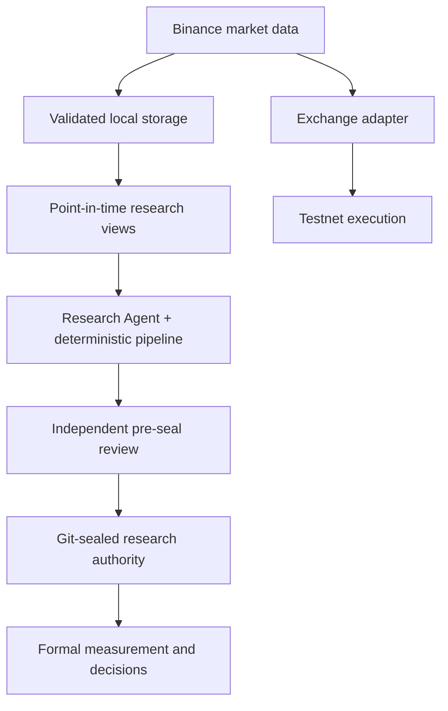

# Architecture

[English](ARCHITECTURE.md) · [繁體中文](ARCHITECTURE.zh-TW.md)

The platform separates market data, research, and execution so that each layer can fail without silently changing the meaning of the others.

## Main boundaries

**Data** handles download, normalization, integrity checks, availability, and provenance.

**Research** only consumes bounded data views. Formal measurement is separated from interpretation and stage advancement.

**Execution** uses typed domain models and `Decimal` for price, quantity, and balance calculations. Unconfirmed orders can enter an explicit `UNKNOWN` state instead of being retried blindly.

**Governance** binds formal runs and downstream transitions to tracked configs and sealed artifacts. Agent-authored scientific configs, criteria, and downstream design artifacts are independently reviewed before their first Git seal. Drift is treated as an error instead of being silently accepted.

**Research automation** uses the repository's bounded control plane rather than bypassing it. The main Research Agent authors the work; an independent Reviewer challenges it before sealing. After outcomes are measured, review becomes stricter and cannot be used as an iterative path to rewrite the result until it passes.
