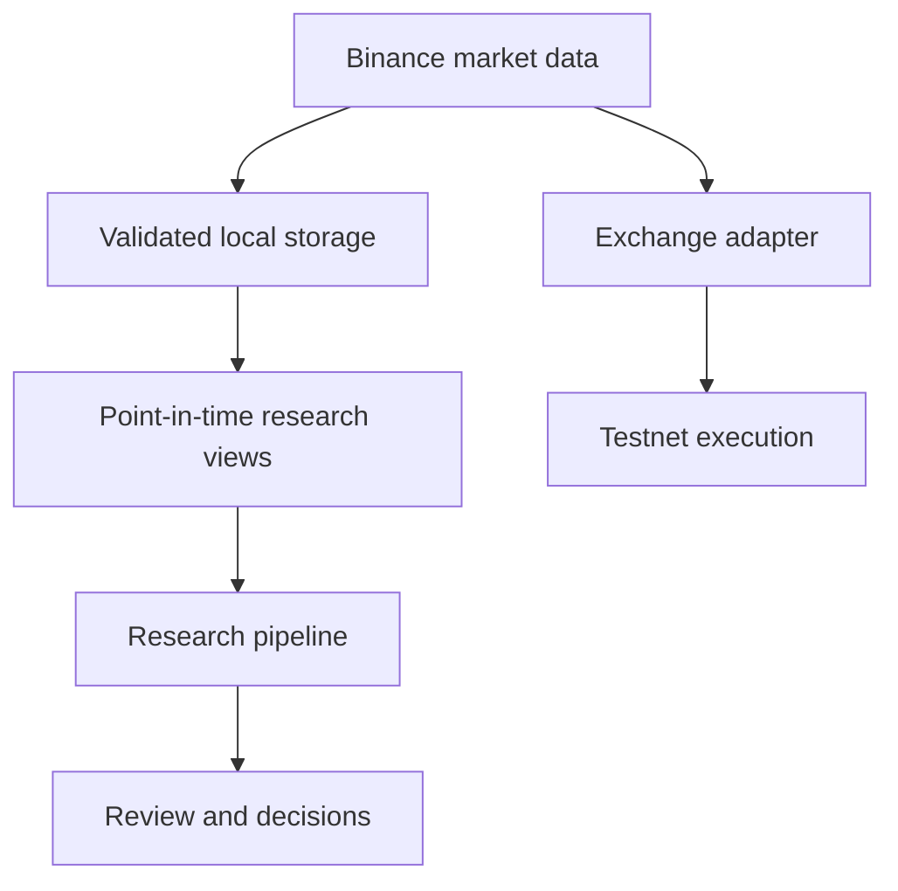

# Architecture

[English](ARCHITECTURE.md) · [繁體中文](ARCHITECTURE.zh-TW.md)

The platform separates market data, research, and execution so that each layer can fail without silently changing the meaning of the others.

## Main boundaries

**Data** handles download, normalization, integrity checks, availability, and provenance.

**Research** only consumes bounded data views. Formal measurement is separated from interpretation and stage advancement.

**Execution** uses typed domain models and `Decimal` for price, quantity, and balance calculations. Unconfirmed orders can enter an explicit `UNKNOWN` state instead of being retried blindly.

**Governance** binds formal runs and downstream transitions to tracked configs and sealed artifacts. Drift is treated as an error instead of being silently accepted.

Review preparation and research automation sit above these boundaries. They are designed to consume existing contracts rather than bypass them.
