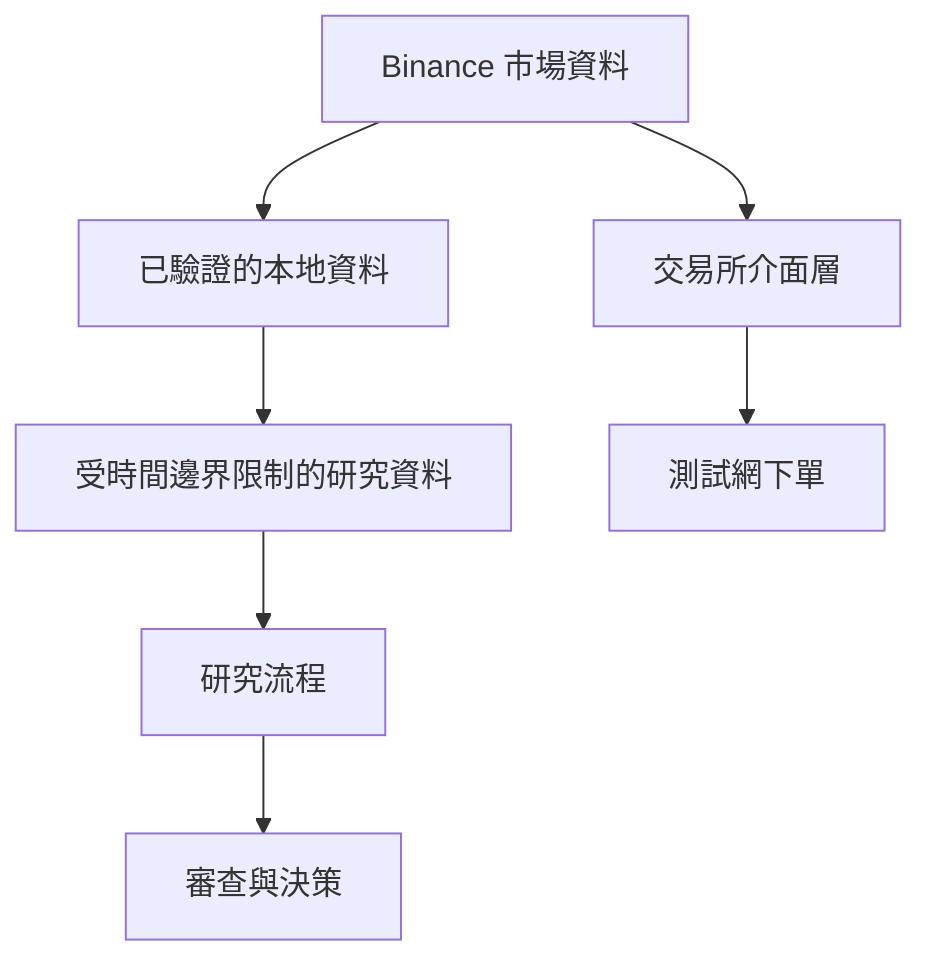

# 系統架構

[English](ARCHITECTURE.md) · [繁體中文](ARCHITECTURE.zh-TW.md)

平台把市場資料、研究與下單執行拆成不同邊界。某一層出問題時，不應默默改變其他層的行為或研究結論。

## 主要邊界

**資料層**負責下載、標準化、完整性檢查、交易時段判定與來源追蹤。

**研究層**只能使用受時間邊界限制的資料。正式量測、研究解讀與是否進入下一階段分開處理。

**執行層**使用強型別資料模型，價格、數量與餘額以 `Decimal` 計算。無法確認結果的委託會進入 `UNKNOWN` 狀態，而不是直接重試。

**治理層**把正式研究、後續階段與版本控制中的設定及研究產物綁定。只要內容漂移或身分不一致，就直接拒絕繼續。

審查與研究自動化建立在這些既有邊界之上，不會繞過它們。
