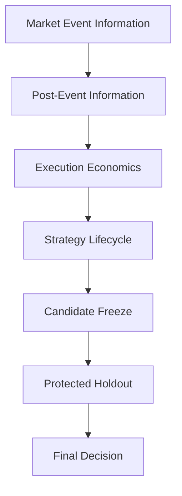

# Research Method

[English](RESEARCH_METHODOLOGY.md) · [繁體中文](RESEARCH_METHODOLOGY.zh-TW.md)

The research flow is staged so that one result cannot quietly justify a stronger claim than it measured.

## Rules that matter

**Point-in-time access** — research code only sees information that was available at that decision time.

**Outcome-blind preflight** — feasibility checks are done without reading future outcome values.

**Separate measurement from judgment** — a completed run does not automatically mean `ADVANCE`.

**Freeze before holdout** — candidate identity and evaluation rules are fixed before protected evidence is used.

**No post-hoc rescue** — a consumed holdout is not a tuning dataset.

**Traceable authority** — configs, run artifacts, and decisions are tied to repository state and validated identities.

The platform also supports bounded agent-operated development research. Automation is allowed to prepare and consume deterministic research facts, but it does not gain authority over Protected Holdout or unrestricted stage advancement.
