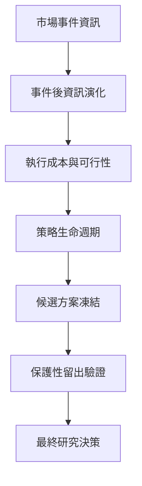

# 研究方法

[English](RESEARCH_METHODOLOGY.md) · [繁體中文](RESEARCH_METHODOLOGY.zh-TW.md)

研究流程刻意拆成多個階段，避免某個結果被拿去支持超出量測範圍的結論。

## 幾個核心規則

**只能使用當下已知的資料** — 研究程式不能看到決策時間點之後才會出現的資訊。

**預檢階段不讀未來結果** — 可行性檢查只能確認資料、設定與結構是否足夠，不能偷看未來表現。

**先審查，再封存** — 只要是研究 Agent 撰寫、會影響研究意義的設定、判定標準或下一階段設計，都要在第一次寫入 Git 前先交給獨立審查 Agent。只要還沒看過未來結果，主要研究 Agent 就可以依同一位審查 Agent 的意見修改草稿，再重新審查；審查通過後才封存。

**量測與判斷分離** — 正式研究跑完，不代表候選方案自動晉級。

**接觸留出資料前先凍結** — 候選方案與評估規則必須先固定，之後才可以使用保護性留出資料。

**不做事後救援** — 已經使用過的留出資料不能回頭拿來調參或修改規則。

**研究依據可追溯** — 設定、研究產物與決策都必須能追溯到明確的版本與身分。

平台也支援受控的自動研究流程。主要研究 Agent 可以依既定流程自主完成第一到第三階段的開發研究；獨立審查 Agent 會在重要研究內容封存前找出設計問題，也會在正式量測後檢查研究解讀是否超出原本的範圍。自動化仍不能自行使用保護性留出資料，也不能自行執行第四階段的正式研究。
